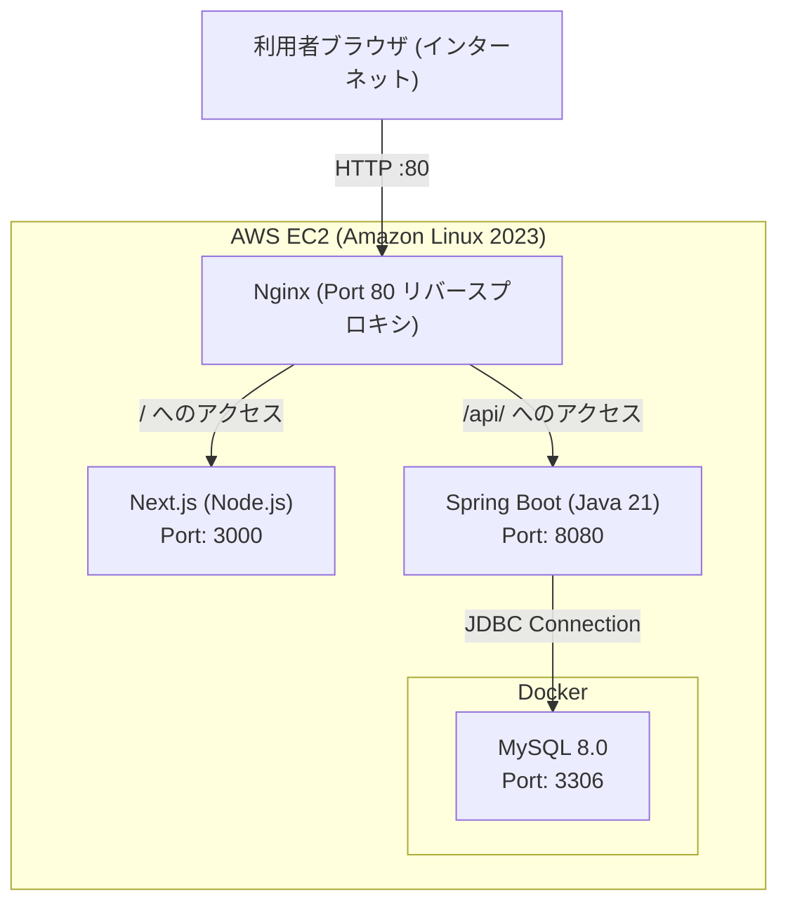

# RepertoList

歌枠配信や動画投稿を行う配信者が、自身の持ち曲・練習中レパートリー、キー設定、歌唱メモを一元管理し、配信準備や選曲を円滑に行うためのWebアプリケーションです。

## 目次

1. [プロジェクト概要](#-プロジェクト概要)
2. [主な機能](#-主な機能)
3. [システム構成・アーキテクチャ](#-システム構成アーキテクチャ)
4. [技術スタック](#-技術スタック)
5. [データベース設計](#-データベース設計)
6. [API仕様](#-api仕様)
7. [プロジェクト構成](#-プロジェクト構成)
8. [ローカル環境セットアップ・起動手順](#-ローカル環境セットアップ起動手順)
9. [スコープ管理（MoSCoW）](#-スコープ管理moscow)

## プロジェクト概要

- **アプリ名**: 配信者向けレパートリー管理ツール（RepertoList）
- **目的**: 配信者が自身の持ち曲・レパートリー（曲名、アーティスト、キー設定、ステータス、メモ）を一元管理し、配信準備や選曲を円滑に行うためのツール。
- **対象ユーザー**: 配信者本人（シングルユーザー）
- **想定データ規模**: 100〜500曲程度

## 主な機能

- **曲の一覧表示・管理**:
  - 登録曲をテーブル形式で一覧表示（曲名、アーティスト、キー、ステータス、メモ）。
- **曲の登録・編集・削除 (CRUD)**:
  - 新規曲の追加、キー設定やステータス・メモの編集、削除（確認ダイアログ付き）。
- **ステータス管理**:
  - 「持ち曲 (ready)」「練習中 (practicing)」「保留 (pending)」の3段階でレパートリーを整理。
- **キー設定の保存**:
  - 原曲キー、および移調キー（+7 〜 -7）を曲ごとに記録可能。
- **絞り込み & キーワード検索**:
  - ステータス別絞り込みセレクトボックス。
  - 曲名・アーティスト名を対象としたリアルタイムインクリメンタル検索。
- **統計サマリー表示**:
  - 全曲数、持ち曲数、練習中数、保留数をダッシュボード画面でひと目で確認可能。

## システム構成・アーキテクチャ

本システムは、AWS EC2 上で Nginx をリバースプロキシとして配置し、フロントエンド（Next.js）とバックエンド（Spring Boot API）を分離した構成を採用しています。



### アーキテクチャ設計の理由

1. **Nginx リバースプロキシの採用**:
   - Webサーバー（フロントエンド）とAPIサーバーを直接インターネットへ露出させず、80番ポートで一元受付してパス（`/`, `/api/`）単位で安全にルーティングするため。
2. **フロントエンドとバックエンドの分離**:
   - UI/UXの変更とデータ処理ロジックを疎結合にし、保守性・テスト容易性および将来の拡張性を向上させるため。
3. **Docker MySQL の採用**:
   - 開発環境と本番環境のポータビリティを確保しつつ、研修無料枠の単一インスタンス内でリソースを効率的に完結させるため。

## 技術スタック

| レイヤー                | 技術 / ライブラリ                        | バージョン / 補足              |
| :---------------------- | :--------------------------------------- | :----------------------------- |
| **フロントエンド**      | Next.js (App Router), React, TypeScript  | Next.js 16系, React 19系       |
| **スタイリング**        | Vanilla CSS (CSS Modules)                | カスタマイズ可能なスタイル制御 |
| **バックエンド**        | Java, Spring Boot                        | Java 21, Spring Boot 4.1系     |
| **データアクセス**      | Spring Data JPA, Hibernate               | ORM・クエリ管理                |
| **バリデーション**      | Jakarta Validation (Hibernate Validator) | `@NotBlank`, `@Size` 等        |
| **APIドキュメント**     | SpringDoc OpenAPI (Swagger UI)           | v2.7.0                         |
| **データベース**        | MySQL                                    | 8.0 (Dockerコンテナ)           |
| **インフラ / デプロイ** | AWS EC2, Nginx, Docker Compose           | Amazon Linux 2023              |

## データベース設計

### `songs` テーブル

| カラム名     | データ型       | NULL |      既定値       | 説明・制約                                                           |
| :----------- | :------------- | :--: | :---------------: | :------------------------------------------------------------------- |
| `id`         | `BIGINT`       |  NO  |  AUTO_INCREMENT   | 主キー                                                               |
| `title`      | `VARCHAR(100)` |  NO  |         -         | 曲タイトル（必須）                                                   |
| `artist`     | `VARCHAR(100)` | YES  |       NULL        | アーティスト名                                                       |
| `music_key`  | `VARCHAR(20)`  | YES  |       NULL        | キー設定（例: 原曲, +2, -1）                                         |
| `status`     | `VARCHAR(20)`  | YES  |      'ready'      | ステータス（`ready`: 持ち曲, `practicing`: 練習中, `pending`: 保留） |
| `memo`       | `VARCHAR(500)` | YES  |       NULL        | 歌唱メモ・配信メモ                                                   |
| `created_at` | `DATETIME`     |  NO  | CURRENT_TIMESTAMP | 登録日時                                                             |

## API仕様

Base URL: `http://localhost:8080` (ローカル) / `/api` (Nginx経由)

| HTTPメソッド | エンドポイント                  | 説明                                                 | 成功時ステータス |
| :----------- | :------------------------------ | :--------------------------------------------------- | :--------------: |
| `GET`        | `/api/v1/songs`                 | 全曲一覧を取得（作成日時降順）                       |     `200 OK`     |
| `GET`        | `/api/v1/songs?status={status}` | 指定ステータスの曲一覧を取得                         |     `200 OK`     |
| `GET`        | `/api/v1/songs/summary`         | ステータス別集計（総数、持ち曲、練習中、保留）を取得 |     `200 OK`     |
| `GET`        | `/api/v1/songs/{id}`            | 指定IDの曲情報を1件取得                              |     `200 OK`     |
| `POST`       | `/api/v1/songs`                 | 新規曲を登録                                         |  `201 Created`   |
| `PUT`        | `/api/v1/songs/{id}`            | 指定IDの曲情報を更新                                 |     `200 OK`     |
| `DELETE`     | `/api/v1/songs/{id}`            | 指定IDの曲を削除                                     | `204 No Content` |

> **API ドキュメント (Swagger UI)**:  
> バックエンド起動後、ブラウザで [http://localhost:8080/swagger-ui.html](http://localhost:8080/swagger-ui.html) にアクセスすると対話型API仕様書を確認・テストできます。

## プロジェクト構成

```text
.
├── compose.yml                # MySQLコンテナ起動定義
├── pom.xml                    # Spring Boot依存関係管理
├── mvnw / mvnw.cmd            # Mavenラッパー
├── DEVELOPMENT_GUIDE.md       # バックエンド開発ガイド
├── README.md                  # 本ドキュメント
├── src/                       # バックエンド ソースコード (Spring Boot)
│   ├── main/
│   │   ├── java/work/fmhr/repertory/
│   │   │   ├── RepertoryApplication.java  # メインクラス
│   │   │   ├── config/                    # CORS等の設定
│   │   │   ├── controller/                # REST Controller (SongController)
│   │   │   ├── dto/                       # Request/Response レコード定義
│   │   │   ├── entity/                    # JPA Entity (Song)
│   │   │   ├── exception/                 # 例外ハンドラ
│   │   │   ├── repository/                # Spring Data JPA Repository
│   │   │   └── service/                   # 業務ロジック層 (SongService)
│   │   └── resources/
│   │       ├── application.properties      # 共通設定
│   │       ├── application-dev.properties  # 開発用設定（MySQL接続等）
│   │       └── application-prod.properties # 本番用設定
│   └── test/                              # 単体テスト・結合テスト
│
└── frontend/                  # フロントエンド ソースコード (Next.js)
    ├── package.json
    ├── next.config.ts
    ├── .env.local             # 接続先API環境変数 (NEXT_PUBLIC_API_URL)
    └── src/
        ├── app/               # App Router ページコンポーネント
        │   ├── page.tsx       # ホーム（サマリーダッシュボード）
        │   ├── songs/         # 曲一覧・詳細・新規作成画面
        │   └── globals.css    # グローバルスタイル
        ├── lib/
        │   └── api.ts         # バックエンドAPIクライアント関数
        └── types/
            └── index.ts       # TypeScript型定義
```

## ローカル環境セットアップ・起動手順

### 前提条件

- **Docker / Docker Compose**
- **Java 21**
- **Node.js 20+** / **npm**

### Step 1: データベース (MySQL) の起動

リポジトリルートで Docker Compose を使用して MySQL コンテナを起動します。

```bash
docker compose up -d
```

- コンテナ名: `final-project-mysql`
- ポート: `3306`
- データベース: `appdb`
- ユーザー/パスワード: `appuser` / `apppass`

### Step 2: バックエンド (Spring Boot) の起動

リポジトリルートで Maven ラッパーを実行してバックエンドを起動します。

```bash
./mvnw spring-boot:run
```

- 起動URL: `http://localhost:8080`
- Swagger UI: `http://localhost:8080/swagger-ui.html`

### Step 3: フロントエンド (Next.js) の起動

新しいターミナルを開き、`frontend` ディレクトリへ移動して依存関係のインストールと開発サーバーの起動を行います。

```bash
cd frontend
npm install
npm run dev
```

- フロントエンドURL: `http://localhost:3000`

ブラウザで [http://localhost:3000](http://localhost:3000) を開くと、アプリケーションを利用できます。

## スコープ管理（MoSCoW）

### Must（必須要件）

- [x] 曲の新規登録（タイトル、アーティスト、キー設定、ステータス、メモ）
- [x] 登録済み曲の一覧表示（件数表示付きテーブル）
- [x] 曲情報の編集・更新
- [x] 曲の削除（確認アラート付き）

### Should（推奨要件）

- [x] ステータス（持ち曲／練習中／保留）での絞り込み表示
- [x] 曲名・アーティスト名でのリアルタイムキーワード検索
- [x] 登録曲数・ステータス別の簡易集計表示（`/api/v1/songs/summary`）

### Won't（将来検討・スコープ外）

- ユーザー認証・ログイン機能（シングルユーザー前提）
- OBS等の配信ソフト連携・オーバーレイ表示
- YouTube / Spotify等の外部音楽API連携
- リアルタイム同期（WebSocket等）
